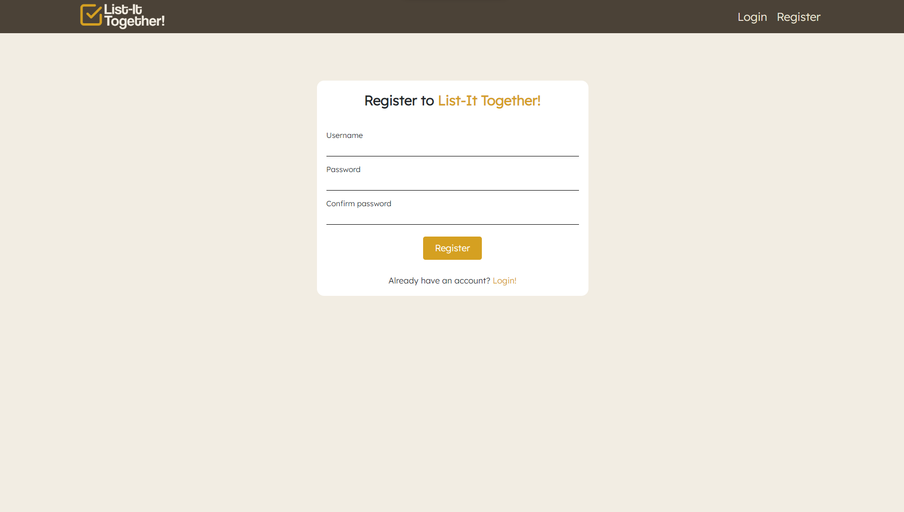
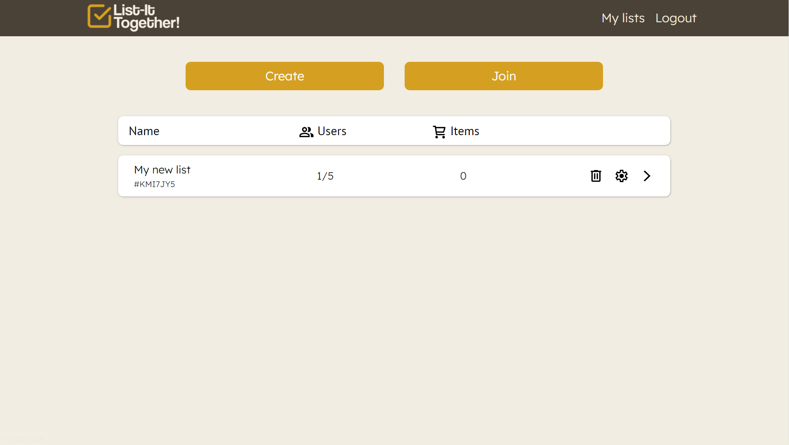
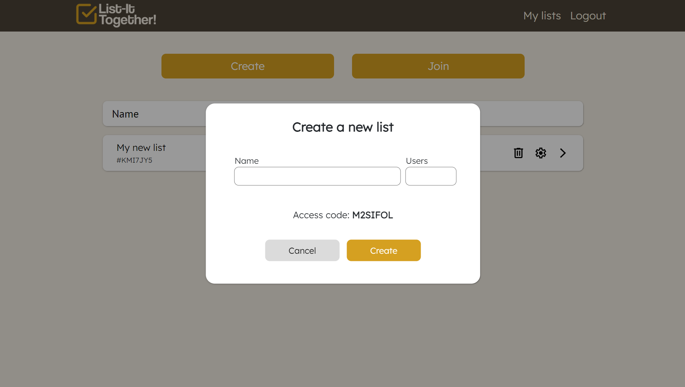
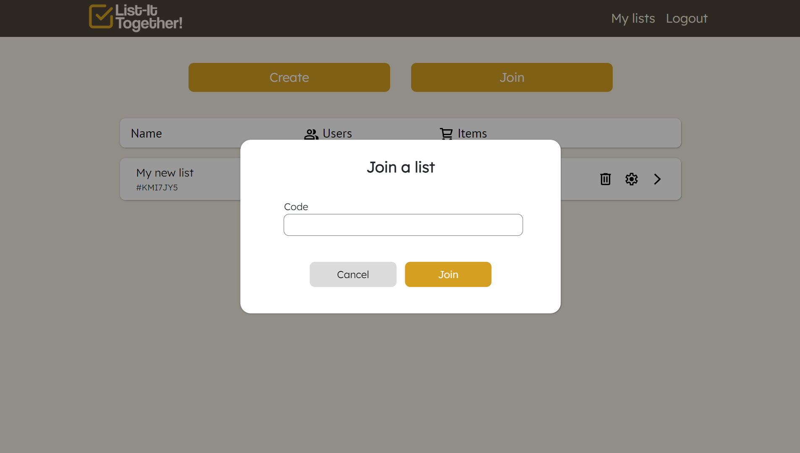
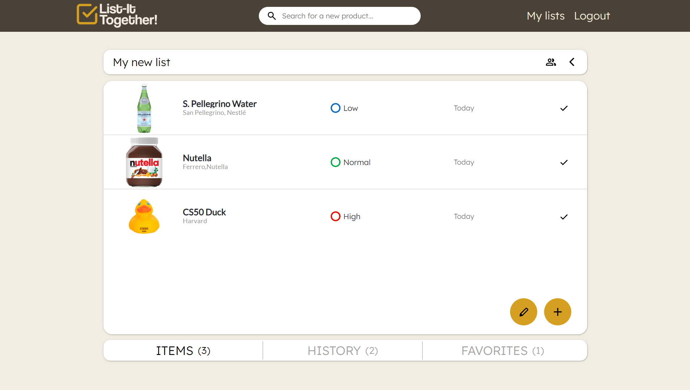
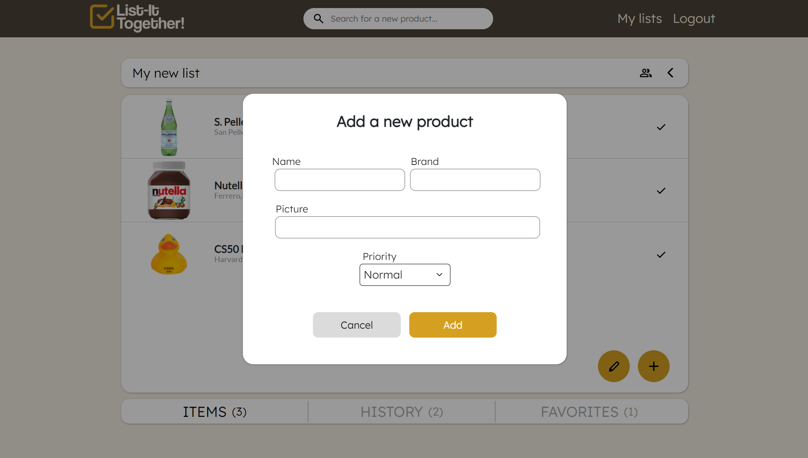
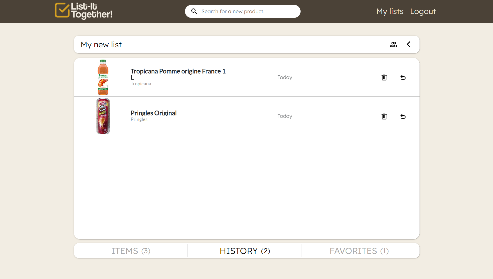
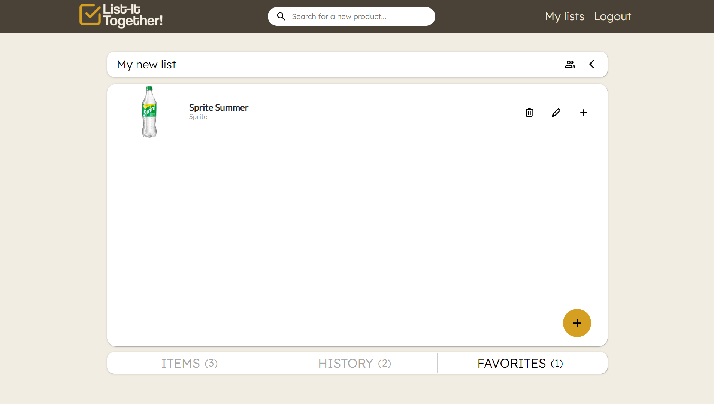
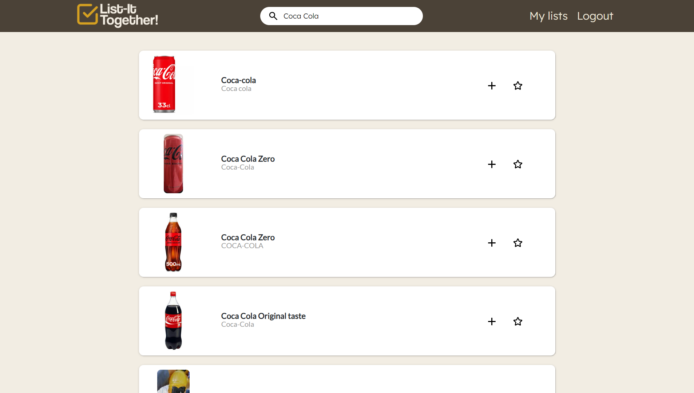

# List-It Together
>This is my final project for the CS50 course.
#### [Video demo](https://www.youtube.com/watch?v=zlETBTHeCtM)

## Description
This is List-It Together! A web application that enables collaborative creation of shopping lists with other users.

## Login/Registration
The first time you visit the website, you will be taken to the account creation page, where you can enter a username and password for later use when logging in. 

## My lists

Once you have created your personal account on the main page, you will find listed all the lists you are participating in. Each list will have three buttons: one to delete/leave, one to edit, and one to access the list. At the top, you will find two buttons that allow you to create new lists or access existing ones. 

- ### Create a list
    To create a new list, simply press the "Create" button, and a popup will appear where you can enter information for your new list. You can specify the list name, the maximum number of allowed users, and a unique code will be generated automatically. This code can be shared with your friends to grant them access to the list. 

- ### Join a list
    Clicking on the "Join" button will open a popup where you will be prompted to enter the code of the list you wish to join. 

## List
After clicking on the arrow to access the list, you will be directed to a page that features a table with three sections: "Items," "History," and "Favorites." You can navigate between these sections using the navigation bar located at the bottom of the screen.

- ### Items
    In this section, you will find the products that need to be purchased, displayed with their name, image, importance level, and the date they were added. At the bottom of the table, you will find two orange buttons that allow you to edit existing product information or add new ones. Next to each product, you will find a button that allows you to mark it as completed. 
    

- ### History
    In this section, you will find a list of all purchased products. Each item will have two buttons allowing you to delete it from the history or reinsert it into the list. 

- ### Favorites
    This section is entirely personal and independent from the main list. Here you can add products you love, and with a simple click on a dedicated button, you can easily add them to the shopping list. 

## Search
Using the search bar, you can quickly find products directly from the [Open Food Facts](https://world.openfoodfacts.org) database. Once the products are loaded, you will have the option to add them to either the shopping list or the favorites list. 

